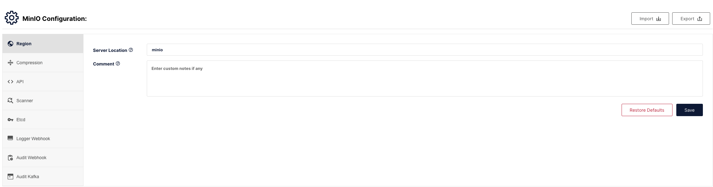
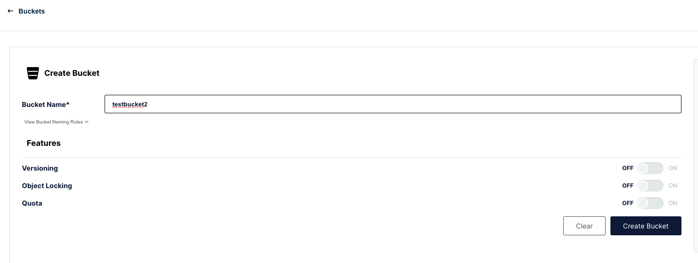
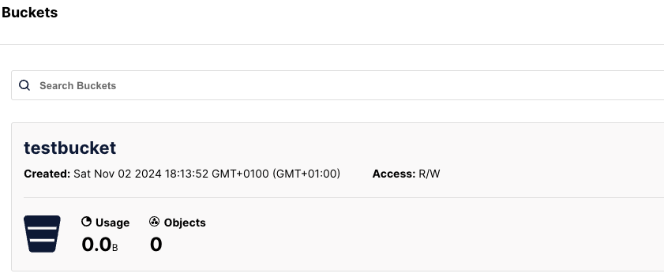
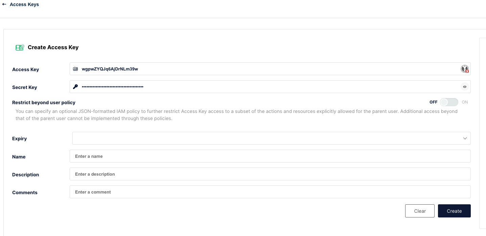

# MinIO configuration:
## Configure Elasticsearch to Use MinIO
- Retreive the MinIO region.
	* Get the “region” defined in MinIO. In the menu side-bar, navigate to Administrator -> Configuration. 
    * Region will be the top option in the resulting page. (if it's not configured yet, you can set it in the same page, but you will be prompted to restart the server)
    
- Create a bucket in MinIO
    * In the menu side-bar, navigate to Buckets -> Create Bucket.
    
    * Enter a name for the bucket and click Create.
    * You should see the bucket in the list of buckets like this:
    
- Create an access key and secret key
    * In the menu side-bar, navigate Access Keys.
    * Enter a name or any additional information you want for the access key.
    * Copy the Access Key and Secret Key in a secure place.
    
    * click Save.
- Configure Elasticsearch (these steps should be done for all Elasticsearch nodes):
    * First, use elasticsearch-keystore to store the MinIO access key and secret key (specify your client name; in our case, we used "default" for convenience).
    ```bash
    sudo /usr/share/elasticsearch/bin/elasticsearch-keystore add s3.client.<Client_Name>.access_key
    ```
    * Enter the access key you copied from MinIO.
    * Repeat the same steps for the secret key.
    ```bash
    sudo /usr/share/elasticsearch/bin/elasticsearch-keystore add s3.client.<Client_Name>.secret_key
    ```


- Create S3 Repository
    * Use the following command to register MinIO as a repository: (either in Kibana Dev Tools or in the terminal with curl)
    ```shell
    PUT _snapshot/my_minio_repository
    {
      "type": "s3",
      "settings": {
        "bucket": "my_bucket",
        "client": "Client_Name",
        "region": "REGION_NAME",
        "endpoint": "http://<minio-host>:9000",
        "protocol": "http"
        "path_style_access": true
      }
    }
    ```
    * Replace my_bucket with the name of the bucket you want to use for storing snapshots.
    * Replace REGION_NAME with the region you obtained from MinIO.
    * Replace Client_Name (in our case we used "default" as the client name).
